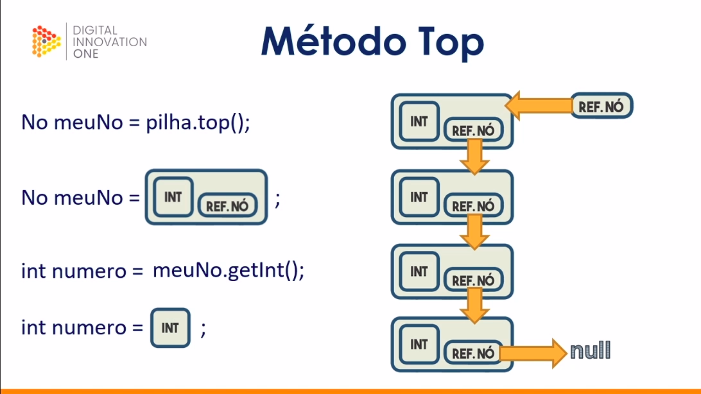
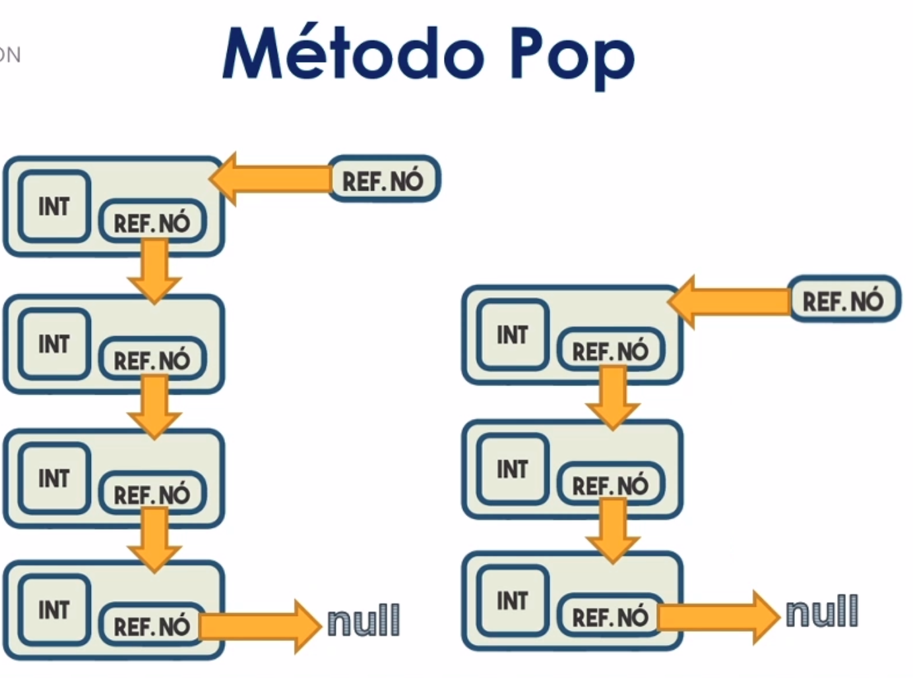
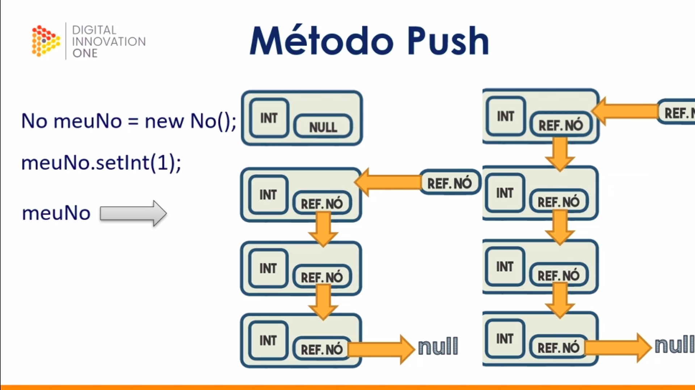

# Estrutura de dados - Pilha

Regra básica desse tipo de estrutura de dados:
<ul>LIFO - Last in, First Out</ul>
 

 

## Método Top

Não exlui, copia a referência do nó que está no topo
 

 

## Método Pop

Tira o primeiro nó da pilha.
 

 

## Método Push

Adiciona um nó ao topo da pilha.
 

 

## Método isEmpty

Checa se um nó está vazio.
 

 